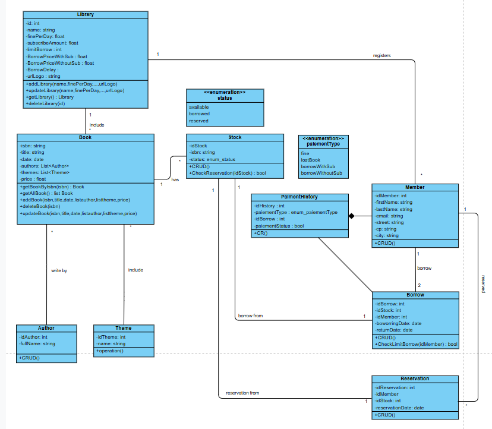
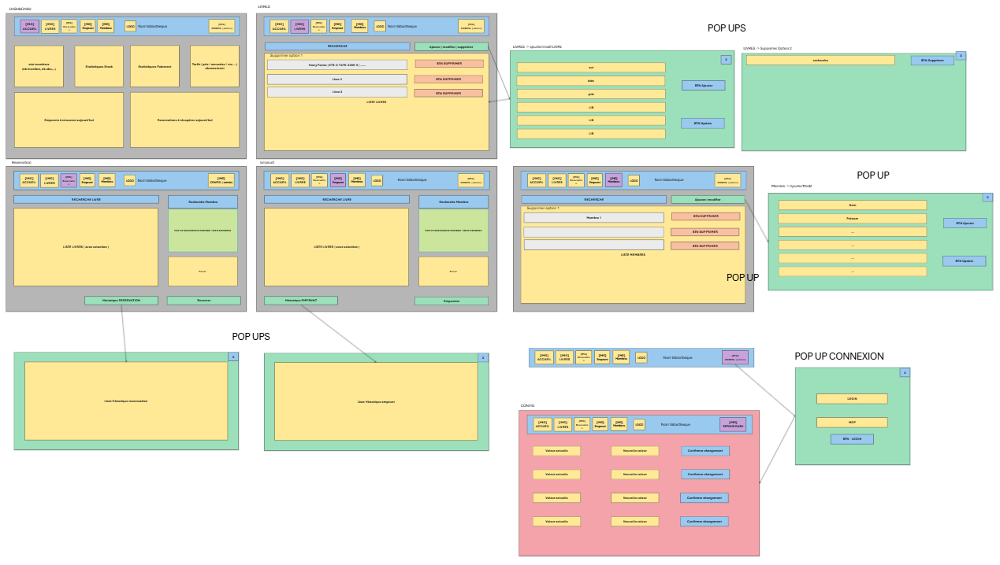

# Procès-Verbal de Réunion – 15 avril 2025

## Ordre du jour
- Décisions de méthodes de travail
- Ébauche d’un diagramme de classes
- Training interne GitHub
- Ébauche du front-end

---

## Présences
- **Présents :** Julien Paquet, Luca Charles, Corentin Germeau, Croitoru Alin  
- **Absents :** *Aucun mentionné*

---

## Fil rouge des réunions précédentes
- / NULL /

---

## Décisions prises
- **Heure de début :** 18h00  
- **Heure de fin :** 20h45
- **Date de la prochaine réunion :** *Non définie*

---

## Commentaires pour la prochaine réunion
- Intégrer un **historique de paiement** (retards, amendes, etc.).
- Clarifier les **types d’utilisateurs** et leur authentification :  
  - Employé / Gestionnaire de la bibliothèque.
- Faire le **training interne GitHub** → **Non effectué ce jour (15 avril 2025)**.

---

## Notes importantes

1. **Procéder en anglais** pour tout ce qui est :
   - Nommage de variables / classes / fonctions
   - Commentaires de code
   - Commits & descriptions GitHub
2. **Rythme de travail** :
   - Une **réunion par semaine minimum**.
3. **Documentation** :
   - Respecter les **PV de réunion précédents**.
4. **Répartition du travail** :
   - Bien départager les **charges entre les membres de l’équipe**.
5. **Modularité** :
   - Toutes les **valeurs configurables** (ex. : prix des abonnements) doivent être **modulables via l’interface**.

---

### Diagramme de classes (ébauche)

### Ébauche du front-end

## Fin de réunion
Synthese de PV rédigée par ChatGPT