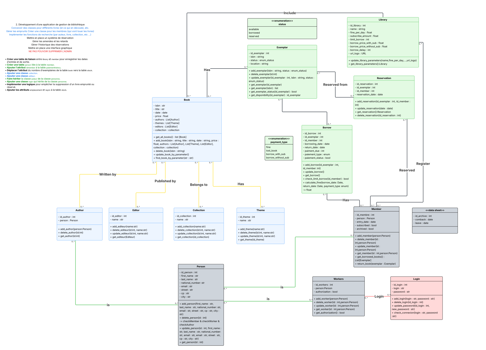

# 📓 IETC_Bibli_24-25

## 📚 Description du Projet

Ce projet est développé dans le cadre de la première année (BAC1) du **bachelier en Informatique - Orientation développement d'applications** à l'**IETC** pour le cours de **Programmation Orientée Objet**.  

Il vise à concevoir une **application complète de gestion de bibliothèque**, permettant la gestion des ouvrages, des emprunts et des utilisateurs via une architecture modulaire.  

Inspiré des principes de la **Clean Architecture**, le projet garantit une **séparation claire des responsabilités**, facilitant son évolution et sa maintenance.

Ce projet nous offre une occasion unique de **renforcer nos compétences techniques**, tout en appliquant **les principes clés de la programmation orientée objet** dans un cadre concret. 🚀  

## 🤝 Notre Groupe

| Profil | Nom | GitHub |
|:-------:|------|--------|
|   | **Luca1550** | [Liens vers le GitHub](https://github.com/Luca1550)
|  | **CroiAlin** | [Liens vers le GitHub](https://github.com/CroiAlin) 
|  | **ZekJulien** | [Liens vers le GitHub](https://github.com/ZekJulien)
|  | **coxi0** | [Liens vers le GitHub](https://github.com/coxi0) 

## 🎯 Objectifs Principaux
- ✅ Gestion des livres : Création de classes dédiées pour structurer les informations sur les ouvrages (titre, auteur, genre, collection, etc.).
- ✅ Gestion des emprunts : Implémentation des mécanismes permettant aux membres de louer des livres, suivre les dates de retour et les amendes éventuelles.
- ✅ Système de réservation : Permettre aux utilisateurs de réserver des livres disponibles ou en attente, avec une gestion automatique des priorités.
- ✅ Recherche avancée : Développement de fonctions de filtrage par auteur, titre, collection ou catégories spécifiques.
- ✅ Suivi des pénalités : Gestion des amendes et des retards, avec un historique détaillé des emprunts et des infractions.
- ✅ Historique des réservations : Stockage des données sur les prêts passés et les réservations effectuées, facilitant la consultation par les administrateurs.
- ✅ Interface graphique intuitive : Mise en place d’une UI interactive via CustomTkinter, offrant une expérience utilisateur fluide et ergonomique.

## 🛑 Contraintes

#### 💾 **Base de données JSON**
Stockage structuré des informations sans nécessité d’un serveur SQL.

## 🛠️ Technologies utilisées

#### 🐍 **Python 3.13** 
- → Langage principal utilisé pour la conception du projet.  
#### 🎨 **CustomTkinter**
-  → Framework permettant de créer une interface graphique moderne et flexible.  
#### 🔹 **JSON (Database)**
-  → Stockage des données sous format JSON, simulant une base de données.  

## 📂 Structure du Projet
- </img> **app**
    - </img> **Repositories**
        - </img> **models**
            - </img> **name.py**
        - </img> **name_repo.py**
    - </img> **services**
        - </img> **models**
            - </img> **name_dto.py**
        - </img> **name_service.py**
    - </img> **tools**
        - </img> **name.py**
    - </img> **ui**
        - </img> **components**
            - </img> **name.py**
        - </img> **pages**
            - </img> **name.py**
    - </img> **main.py**
- </img> **database**
    - </img> **name.json**
- </img> **requirements.txt**

## 📂 Structure détaillée
</img> **app** Cœur du projet : Regroupe tous les modules essentiels qui structurent l’application.

</img> **main.py** : Le point d'entrée principal de notre application.

</img> **models** : Contient les définitions des classes et structures de données. Utile pour représenter des entités.

</img> **repositories** : Regroupe les accès a la base de données en json.

</img> **services** : Regroupe les fonctionnalités ou services métiers (business logic), comme la gestion des Auteurs, des Thèmes, ou toute autre opération métier.

</img> **tools** : Héberge les outils et utilitaires comme le JsonDecoder.

</img> **ui** : Concentre les éléments liés à l'interface utilisateur avec CustomTkinter.

</img> **components** : Sous-dossier de ui, il contient les petits éléments réutilisables de l'interface.

</img> **pages** : Contient les vues complètes, comme les pages de l'application (ex. page d'accueil, page livres).

</img> **data** : Contient les fichiers de données utilisés pour la persistance. Les fichiers JSON présents ici simulent une base de données et servent de stockage structuré pour l'application

</img> **requirements.txt** : Liste des dépendances (bibliothèques Python) nécessaires pour exécuter le projet.

## ✏️ Style de notation

### Nomenclature

#### Nom des fichiers en **snake_case**.
>example_service.py

#### Nom des classes en **CamelCase**.
>
>class ExamplePage:

#### Nom des variables en **snake_case**
>
>name_variable = "example" 

#### Nom des fonctions en **snake_case**
>
>def function_name(): 

#### Pour l'ensemble du code et du projet nous procéderons en Anglais.

> En partant des bonnes pratiques recommandées par le guide *["PEP 8 – Style Guide for Python Code"](https://peps.python.org/pep-0008/)*.

## 📊 Diagrammes de classes (ébauche)

## 🐍 Installation et Utilisation

### ℹ️ Remarque
Ce projet a été développé en Python 3.13 et est donc conçu pour fonctionner sous cette version. \
Il est recommandé d’utiliser la même version pour garantir une compatibilité optimale et éviter tout problème lié à des changements dans les bibliothèques standard ou les dépendances.

### 1️⃣ **Cloner le projet**
Commencez par récupérer le code source sur votre machine :  
    
    git clone https://github.com/Luca1550/IETC_Bibli_24-25.git

### 2️⃣ **Utilisation d'un environement virtuel**
Il est recommandé d'utiliser un environnement virtuel pour isoler les dépendances du projet (à la racine du clone): 

    py -3 -m venv .venv

### 3️⃣ **Activer l'environement virtuel**
En fonction de l'OS : 
#### Windows  :

    .\.venv\Scripts\activate
#### MacOs/Linux  :

    WYP

### 4️⃣ **Installer les dépendances**
Une fois l’environnement activé, installez les bibliothèques nécessaires en exécutant :

    pip install -r requirements.txt

### 5️⃣ **Lancer l’application**
Une fois les dépendances installées vous pouvez executer l'application:

    python .\app\main.py

## 🔜 Améliorations envisageables

### 1️⃣ **Gestion des comptes utilisateurs et des droits d’accès**
Actuellement, seul un compte administrateur est prévu. Une amélioration importante consisterait à permettre la création d’un compte personnel pour chaque employé (Worker), avec une gestion des rôles (ex. : bibliothécaire, assistant). Chaque action (ajout, suppression, modification) pourrait alors être restreinte ou autorisée en fonction du rôle de l’utilisateur.

### 2️⃣ **Système de notifications et rappels automatisés**
Mettre en place un système de notifications internes (et/ou par email) pour alerter lorsqu’un emprunt ou une réservation arrive à échéance. Cela pourrait prévenir les retards et améliorer le suivi des utilisateurs.

### 3️⃣ **Refactorisation de l’architecture des repositories**
Introduire un BaseRepository commun pour centraliser les méthodes génériques (CRUD, get_by_id(), get_all(), etc.) et la gestion des fichiers JSON. Cela permettrait de réduire la duplication de code entre les différents dépôts (comme BookRepository, ThemeRepository, etc.) et de renforcer la cohérence globale de l’architecture.

### 4️⃣ **Génération de statistiques et rapports**
Utiliser des bibliothèques comme pandas ou numpy pour analyser les données (fréquence des emprunts, livres les plus consultés, retards, etc.) et produire des rapports dynamiques. Cela fournirait une vue d’ensemble utile à la gestion de la bibliothèque.

### 5️⃣ **Amélioration de l’interface utilisateur (UI/UX)**
L’interface pourrait être rendue plus ergonomique et intuitive :

    Ajout de pagination.
    Affichage plus fluide des composants (éviter leur recréation systématique).
    Intégration de retours visuels (animations, loaders, confirmations).

### 6️⃣ **Sauvegarde automatique et journalisation**
Ajouter un système de backup régulier des données JSON, ainsi qu’une journalisation des actions critiques (log des suppressions, modifications, connexions, etc.) afin de renforcer la sécurité et la traçabilité.

### 7️⃣ **Archivage des anciens membres**
Mettre en place un système pour archiver les anciens membres (inactifs depuis X mois/années) tout en conservant leur historique. Cela permettrait d'alléger l’affichage tout en gardant la cohérence des emprunts passés.
